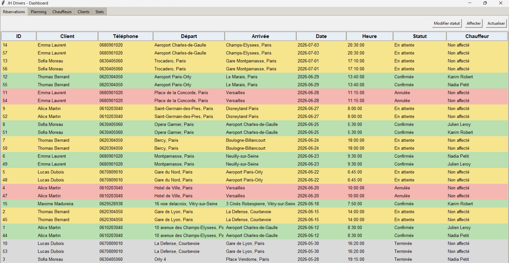
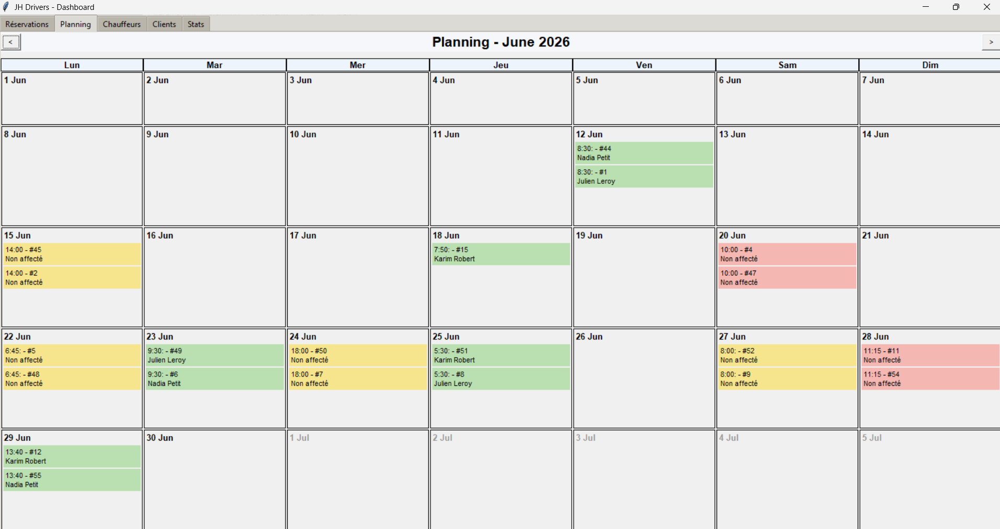

# JH Drivers App

Application de bureau Python permettant aux administrateurs de gérer les réservations, les chauffeurs, les clients et le planning de JH Drivers.

Cette application constitue le client lourd d'administration de JH Drivers.


---

## Fonctionnalités

- Authentification administrateur par identifiant et mot de passe
- Tableau de bord avec statistiques sur les réservations
- Gestion des réservations : modification de statut et affectation d'un chauffeur
- Planning mensuel des courses
- Gestion des chauffeurs : ajout, modification et suppression
- Gestion des clients : ajout, modification et suppression

---

## Stack technique

| Composant | Technologie |
|-----------|-------------|
| Langage | Python 3 |
| Interface graphique | Tkinter / ttk |
| Base de données | MySQL / MariaDB |
| Accès BDD | mysql-connector-python avec requêtes préparées |
| Architecture | Couches séparées (modèles / services / GUI) |
| Versionning | Git / GitHub |

---

## Démo

Pour tester l'application, utilisez le compte suivant :

| Champ | Valeur |
|-------|--------|
| Identifiant | Maxime Madureira |
| Mot de passe | Efrei2026* |

---

## Structure du projet

```text
.
├── main.py
├── requirements.txt
├── install_app.sh
├── README.md
├── database/
│   ├── __init__.py
│   ├── database.py
├── models/
│   ├── administrator.py
│   ├── chauffeur.py
│   ├── reservation.py
│   ├── status.py
│   └── user.py
├── services/
│   ├── affectation_service.py
│   ├── auth_service.py
│   ├── chauffeur_service.py
│   ├── reservation_service.py
│   ├── stats_service.py
│   └── user_service.py
└── gui/
    ├── dashboard.py
    ├── dashboard_handlers.py
    ├── login_view.py
    ├── reservations_view.py
    ├── chauffeurs_view.py
    ├── users_view.py
    └── calendar_view.py
```

---

## Installation

### Prérequis

- Python 3.10 ou supérieur
- Tkinter
- Accès Internet pour joindre la base MySQL distante

### Lancer l'application après avoir cloné ou téléchargé le dossier

Depuis la racine du projet, ouvrez un terminal puis exécutez :

```powershell
python -m venv .venv
.venv\Scripts\activate
pip install -r requirements.txt
python main.py
```

Si vous êtes sur Linux ou macOS :

```bash
python3 -m venv .venv
source .venv/bin/activate
pip install -r requirements.txt
python main.py
```

L'application se connecte directement à la base de données en ligne déjà configurée dans `database/database.py`.
Il n'y a pas de schéma à créer ni de base locale à installer.

